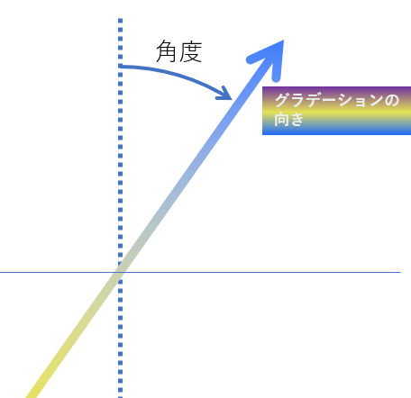

import { CodePreview } from '@kodai-yamamoto-siw/code-preview';
import Exercise, { Solution } from '@kodai-yamamoto-siw/exercise/client';

## 今日の学習はこんなところで使うよ

このページでは、border-radius、text-shadow、box-shadow、グラデーションといった、ウェブサイトを視覚的に魅力的にするための装飾エフェクトを学びます。これらの技術は、ボタンやカード、ヘッダーなど、あらゆる要素をデザインする際に幅広く使われています。例えば、オンラインショップの商品カードに影をつけて立体感を出したり、ボタンに丸みをつけてやさしい印象にしたり、見出しにグラデーションを使って目を引くデザインにしたりします。

### 例: プロモーションカードのデザイン
<CodePreview
  initialHTML={`<div class="promo-card">
    <div class="promo-badge">NEW</div>
    <h2 class="promo-title">秋のスペシャルセール</h2>
    <p class="promo-desc">今だけ全品20%OFF。期間限定オファーをお見逃しなく！</p>
    <button class="promo-cta">今すぐ見る</button>
  </div>`}
  initialCSS={`.promo-card {
    width: 320px;
    padding: 24px;
    border-radius: 16px;
    /* ダークなグラデーションにして文字の可読性を向上 */
    background: linear-gradient(135deg, #2b0b3a 0%, #2a2b8d 70%);
    color: #ffffff;
    box-shadow: 0 12px 30px rgba(0,0,0,0.36);
    position: relative;
    font-family: Arial, sans-serif;
  }
  .promo-badge {
    position: absolute;
    top: 16px;
    right: 16px;
    /* アクセントカラーで視認性を確保 */
    background: #ff8a00;
    color: #fff;
    padding: 6px 10px;
    border-radius: 12px;
    font-weight: bold;
    text-shadow: 0 1px 2px rgba(0, 0, 0, 0.4);
  }
  .promo-title {
    margin: 8px 0 8px 0;
    font-size: 20px;
    text-shadow: 2px 2px 6px rgba(0,0,0,0.35);
  }
  .promo-desc {
    margin: 0 0 18px 0;
    font-size: 14px;
    line-height: 1.4;
    text-shadow: 1px 1px 3px rgba(0,0,0,0.25);
  }
  .promo-cta {
    padding: 10px 18px;
    background: #ffffff; /* 白背景で文字をはっきり */
    color: #2a2b8d;     /* カードの濃い色と調和する濃色テキスト */
    border: 0;
    border-radius: 10px;
    font-weight: bold;
    text-align: center;
    box-shadow: 0 6px 12px rgba(0,0,0,0.18);
    cursor: pointer;
    transition: transform 160ms ease, box-shadow 160ms ease, background 160ms ease;
  }
  .promo-cta:hover {
    transform: translateY(-4px);
    box-shadow: 0 14px 22px rgba(0,0,0,0.32);
    background: #f2f2f2;
  }
  .promo-cta:active {
    transform: translateY(-2px);
  }`}
  htmlVisible={false}
  cssVisible={false}
  previewVisible={true}/>

## border-radius（角の丸み）

`border-radius` は要素の角を丸くするプロパティです。値を大きくするほど丸みが強くなります。

**書き方:**
```css
border-radius: 値;
```

- 値: ピクセル（`px`）やパーセント（`%`）で指定
- `50%` で正方形を円にできる

**例:**

<CodePreview
  initialHTML={`<div class="box1">角丸（小）</div>
  <div class="box2">角丸（大）</div>
  <div class="box3">円形</div>`}
  initialCSS={`.box1 {
    border-radius: 8px;

    width: 150px;
    padding: 20px;
    margin: 10px 0;
    background: #ffdddd;
  }
  .box2 {
    border-radius: 20px;

    width: 150px;
    padding: 20px;
    margin: 10px 0;
    background: #ddffdd;
  }
  .box3 {
    border-radius: 50%;

    width: 100px;
    height: 100px;
    margin: 10px 0;
    background: #ddddff;
    text-align: center;
  }`}
/>


### 個別の角を指定

4つの角を個別に指定することもできます。

**書き方:**
```css
border-radius: 左上 右上 右下 左下;
```

**例:**

<CodePreview
  initialHTML={`<div class="box">左上だけ丸い</div>`}
  initialCSS={`.box {
    border-radius: 20px 0 0 0;

    width: 150px;
    padding: 20px;
    background: #ffe5cc;
  }`}
/>

<Exercise title="演習1（角丸ボタンを作る）">

以下のHTML要素に対して、CSSで見た目を作ってください（HTMLコメントに指示があります）：

<CodePreview
  sourceId="exercise1"
  initialHTML={`<!-- 幅: 200px -->
<!-- パディング: 上下12px、左右24px -->
<!-- 背景色: #4a90e2 -->
<!-- 文字色: white -->
<!-- 角丸: 8px -->
<!-- 中央揃え（text-align: center） -->
<div class="btn">クリック</div>`}
  initialCSS={`.btn {
    width: 200px;
    padding: 12px 24px;
    background: #4a90e2;
    color: white;
    border-radius: 8px;
    text-align: center;
  }`}
  cssVisible={false}
/>

<Solution>

<CodePreview sourceId="exercise1" />

**解説:**
- `border-radius: 8px;` で角を丸くしています。
- `padding: 12px 24px;` で上下と左右のパディングを指定しています。

</Solution>
</Exercise>

<Exercise title="演習2（円形アイコンを作る）">

以下のHTML要素に対して、CSSで見た目を作ってください（HTMLコメントに指示があります）：

<CodePreview
  sourceId="exercise2"
  initialHTML={`<!-- 幅: 80px -->
<!-- 高さ: 80px -->
<!-- 背景色: #ff6b6b -->
<!-- 文字色: white -->
<!-- 完全な円形にする -->
<!-- テキストを左右中央に配置（text-align: center を使用） -->
<div class="icon">A</div>`}
  initialCSS={`.icon {
    width: 80px;
    height: 80px;
    background: #ff6b6b;
    color: white;
    border-radius: 50%;
    text-align: center;
  }`}
  cssVisible={false}
/>

<Solution>

<CodePreview sourceId="exercise2" />

**解説:**
- `border-radius: 50%;` で正方形を完全な円にできます。
- `text-align: center;` でテキストを左右中央に配置しています。

</Solution>
</Exercise>

<Exercise title="演習2-発展（個別の角丸を使った吹き出し風ボックスを作る）">

以下のHTML要素に対して、CSSで見た目を作ってください（HTMLコメントに指示があります）：

<CodePreview
  sourceId="exercise2-advanced"
  initialHTML={`<!-- 幅: 220px -->
<!-- パディング: 20px -->
<!-- 背景色: #ffeaa7 -->
<!-- 文字色: #2d3436 -->
<!-- 角丸（個別指定）: 左上20px、右上20px、右下20px、左下0 -->
<div class="speech">こんにちは！</div>`}
  initialCSS={`.speech {
    width: 220px;
    padding: 20px;
    background: #ffeaa7;
    color: #2d3436;
    border-radius: 20px 20px 20px 0;
  }`}
  cssVisible={false}
/>

<Solution>

<CodePreview sourceId="exercise2-advanced" />

**解説:**
- `border-radius: 20px 20px 20px 0;` で左下の角だけ丸くしないことで、吹き出しのような形を作れます。
- 4つの値は「左上 右上 右下 左下」の順番です。

</Solution>
</Exercise>

## text-shadow（文字に影）

`text-shadow` は文字に影をつけるプロパティです。立体感や強調効果を出せます。

**書き方:**
```css
text-shadow: 横方向 縦方向 ぼかし 色;
```

- 横方向・縦方向: 影の位置（正の値で右下へ）
- ぼかし: 影のぼかし具合（大きいほどぼける）
- 色: 影の色（`rgba` で透明度を指定するのが一般的）

**例:**

<CodePreview
  initialHTML={`<h2 class="title1">影付きタイトル</h2>
  <h2 class="title2">強い影</h2>`}
  initialCSS={`.title1 {
    text-shadow: 2px 2px 4px rgba(0, 0, 0, 0.3);

    font-size: 32px;
    color: #333;
  }
  .title2 {
    text-shadow: 4px 4px 8px rgba(0, 0, 0, 0.5);

    font-size: 32px;
    color: #ff6b6b;
  }`}
/>

<Exercise title="演習3（影付き見出しを作る）">

以下のHTML要素に対して、CSSで見た目を作ってください（HTMLコメントに指示があります）：

<CodePreview
  sourceId="exercise3"
  initialHTML={`<!-- フォントサイズ: 36px -->
<!-- 文字色: #2c3e50 -->
<!-- 影: 横3px、縦3px、ぼかし6px、色は rgba(0, 0, 0, 0.4) -->
<h1 class="heading">重要なお知らせ</h1>`}
  initialCSS={`.heading {
    font-size: 36px;
    color: #2c3e50;
    text-shadow: 3px 3px 6px rgba(0, 0, 0, 0.4);
  }`}
  cssVisible={false}
/>

<Solution>

<CodePreview sourceId="exercise3" />

**解説:**
- `text-shadow` の値は「横 縦 ぼかし 色」の順で指定します。
- `rgba(0, 0, 0, 0.4)` で半透明の黒い影を指定しています。

</Solution>
</Exercise>

## box-shadow（要素に影）

`box-shadow` は要素全体に影をつけるプロパティです。カードやボタンに立体感を出すのに使います。

**書き方:**
```css
box-shadow: 横方向 縦方向 ぼかし 色;
```

- 横方向・縦方向: 影の位置
- ぼかし: 影のぼかし具合
- 色: 影の色

**ポイント:**
- 横方向を `0` にして縦方向だけ指定すると、下に影が落ちて浮いた感じになる

**例:**

<CodePreview
  initialHTML={`<div class="card1">カード1</div>
  <div class="card2">カード2（浮いた感じ）</div>`}
  initialCSS={`.card1 {
    box-shadow: 2px 2px 8px rgba(0, 0, 0, 0.2);

    width: 200px;
    padding: 20px;
    margin: 20px 0;
    background: white;
    border-radius: 8px;
  }
  .card2 {
    box-shadow: 0 4px 12px rgba(0, 0, 0, 0.3);

    width: 200px;
    padding: 20px;
    margin: 20px 0;
    background: white;
    border-radius: 8px;
  }`}
/>

<Exercise title="演習4（影付きカードを作る）">

以下のHTML要素に対して、CSSで見た目を作ってください（HTMLコメントに指示があります）：

<CodePreview
  sourceId="exercise4"
  initialHTML={`<!-- 幅: 250px -->
<!-- パディング: 24px -->
<!-- 背景色: white -->
<!-- 角丸: 12px -->
<!-- 影: 横0、縦6px、ぼかし16px、色は rgba(0,0,0,0.25) -->
<div class="card">商品カード</div>`}
  initialCSS={`.card {
    width: 250px;
    padding: 24px;
    background: white;
    border-radius: 12px;
    box-shadow: 0 6px 16px rgba(0,0,0,0.25);
  }`}
  cssVisible={false}
/>

<Solution>

<CodePreview sourceId="exercise4" />

**解説:**
- 横方向を `0` にすることで、影が左右対称になります。

</Solution>
</Exercise>

<Exercise title="演習4-発展（ホバー時に影が強くなるカードを作る）">

以下のHTML要素に対して、CSSで見た目を作ってください（HTMLコメントに指示があります）：

<CodePreview
  sourceId="exercise4-advanced"
  initialHTML={`<!-- 幅: 250px -->
<!-- パディング: 24px -->
<!-- 背景色: white -->
<!-- 角丸: 12px -->
<!-- 通常時の影: 横0、縦4px、ぼかし8px、色は rgba(0,0,0,0.15) -->
<!-- ホバー時の影: 横0、縦8px、ぼかし24px、色は rgba(0, 0, 0, 0.3) -->
<div class="card">ホバーしてみて</div>`}
  initialCSS={`.card {
    width: 250px;
    padding: 24px;
    background: white;
    border-radius: 12px;
    box-shadow: 0 4px 8px rgba(0,0,0,0.15);
  }
  .card:hover {
    box-shadow: 0 8px 24px rgba(0, 0, 0, 0.3);
  }`}
  cssVisible={false}
/>

<Solution>

<CodePreview sourceId="exercise4-advanced" />

**解説:**
- `:hover` 疑似クラスを使って、マウスを重ねたときに影を強くしています。

</Solution>
</Exercise>

## グラデーション（linear-gradient）

`linear-gradient` は直線的なグラデーションを持つ画像を生成するCSS関数です。背景に使うことで、単色よりも豊かな表現ができます。

**書き方:**
```css
background: linear-gradient(方向, 開始色, 終了色);
```

- 方向: `to bottom`（下へ）、`to right`（右へ）、`45deg`（角度）など
- 3色以上も指定できる（例: `linear-gradient(to right, red, yellow, green)`）
- `background-image` として使えるということ（画像を生成する関数なので）

**例:**

<CodePreview
  initialHTML={`<div class="grad1">上から下へ</div>
  <div class="grad2">左から右へ</div>
  <div class="grad3">斜め</div>`}
  initialCSS={`.grad1 {
    background: linear-gradient(to bottom, #ff6b6b, #ffd93d);

    width: 200px;
    height: 100px;
    margin: 10px 0;
  }
  .grad2 {
    background: linear-gradient(to right, #6bcf7f, #4a90e2);

    width: 200px;
    height: 100px;
    margin: 10px 0;
  }
  .grad3 {
    background: linear-gradient(45deg, #fff, #fd79a8);

    width: 200px;
    height: 100px;
    margin: 10px 0;
  }`}
/>



<Exercise title="演習5（グラデーションバナーを作る）">

以下のHTML要素に対して、CSSで見た目を作ってください（HTMLコメントに指示があります）：

<CodePreview
  sourceId="exercise5"
  initialHTML={`<!-- 幅: 400px -->
<!-- 高さ: 150px -->
<!-- 背景: 左から右へのグラデーション（#ff6b6b から #4ecdc4） -->
<div class="banner">キャンペーン実施中</div>`}
  initialCSS={`.banner {
    width: 400px;
    height: 150px;
    background: linear-gradient(to right, #ff6b6b, #4ecdc4);
  }`}
  cssVisible={false}
/>

<Solution>

<CodePreview sourceId="exercise5" />

**解説:**
- `linear-gradient(to right, #ff6b6b, #4ecdc4)` で左から右へのグラデーション画像を生成しています。
- `background` や `background-image` プロパティに指定できます。

</Solution>
</Exercise>

## グラデーション（radial-gradient）

`radial-gradient` は中心から外側へ広がる円形のグラデーションを持つ画像を生成するCSS関数です。

**書き方:**
```css
background: radial-gradient(形状, 開始色, 終了色);
```

- 形状: `circle`（円）、`ellipse`（楕円）
- `background-image` でも使える（画像を生成する関数なので）

**例:**

<CodePreview
  initialHTML={`<div class="radial1">円形グラデーション</div>
  <div class="radial2">楕円グラデーション</div>`}
  initialCSS={`.radial1 {
    background: radial-gradient(circle, #ffd93d, #ff6b6b);

    width: 200px;
    height: 200px;
    margin: 10px 0;
    text-align: center;
  }
  .radial2 {
    background: radial-gradient(ellipse, #ffd93d, #6c5ce7);

    width: 300px;
    height: 150px;
    margin: 10px 0;
    text-align: center;
  }`}
/>

<Exercise title="演習6（円形グラデーションボタンを作る）">

以下のHTML要素に対して、CSSで見た目を作ってください（HTMLコメントに指示があります）：

<CodePreview
  sourceId="exercise6"
  initialHTML={`<!-- 幅: 180px -->
<!-- 高さ: 180px -->
<!-- 背景: 円形グラデーション（#6bcf7f から #4a90e2） -->
<!-- 文字色: white -->
<!-- 完全な円形（border-radius: 50%） -->
<!-- テキストを左右中央に配置（text-align: center を使用） -->
<!-- フォントサイズ: 20px -->
<div class="circle-btn">START</div>`}
  initialCSS={`.circle-btn {
    width: 180px;
    height: 180px;
    background: radial-gradient(circle, #6bcf7f, #4a90e2);
    color: white;
    border-radius: 50%;
    text-align: center;
    font-size: 20px;
  }`}
  cssVisible={false}
/>

<Solution>

<CodePreview sourceId="exercise6" />

**解説:**
- `radial-gradient(circle, #6bcf7f, #4a90e2)` で中心から外側へのグラデーション画像を生成しています。
- `border-radius: 50%;` と組み合わせることで、円形になります。

</Solution>
</Exercise>

<Exercise title="演習6-発展（複数の装飾を組み合わせたカードを作る）">

以下のHTML要素に対して、CSSで見た目を作ってください（HTMLコメントに指示があります）：

<CodePreview
  sourceId="exercise6-advanced"
  initialHTML={`<!-- 幅: 280px -->
<!-- パディング: 32px -->
<!-- 背景: 斜め45度のグラデーション（#f093fb から #f5576c） -->
<!-- 文字色: white -->
<!-- 角丸: 16px -->
<!-- 要素に影: 横0、縦8px、ぼかし20px、色は rgba(0, 0, 0, 0.3) -->
<!-- フォントサイズ: 24px -->
<!-- テキストに影: 横2px、縦2px、ぼかし4px、色は rgba(0, 0, 0, 0.4) -->
<div class="special-card">特別オファー</div>`}
  initialCSS={`.special-card {
    width: 280px;
    padding: 32px;
    background: linear-gradient(45deg, #f093fb, #f5576c);
    color: white;
    border-radius: 16px;
    box-shadow: 0 8px 20px rgba(0, 0, 0, 0.3);
    font-size: 24px;
    text-shadow: 2px 2px 4px rgba(0, 0, 0, 0.4);
  }`}
  cssVisible={false}
/>

<Solution>

<CodePreview sourceId="exercise6-advanced" />

**解説:**
- `border-radius`、`box-shadow`、`text-shadow`、`linear-gradient` を組み合わせることで、複数の装飾を同時に使えます。

</Solution>
</Exercise>

## 練習: デザインに合わせて作る

最後に、練習として次のデザイン通りのサイトを作ってみましょう。

デザインへのリンク: https://www.figma.com/design/nAh5Afbk4orz7pzNTkWXTi/Cooking-Template-%F0%9F%9F%A3-by-Flowbase.co--Community-?node-id=1-296&t=E5hswHM2pZZuyH0L-1

### 著作権元
<p style={{"font-size":"0.8em"}}><a href="https://www.figma.com/community/file/1093372331682706566" target="_blank" rel="noopener noreferrer">上述のデザインの元デザイン</a></p>
